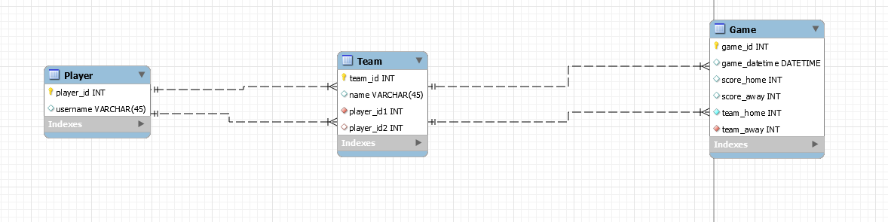

# Table Football Coding Challenge




## Introduction
This web API is used to monitor the internal football table championship. 

### Used technologies
- [Symfony](https://symfony.com/): v5.2.3
- [Api-platform](https://api-platform.com/): v2.5.10
- SQLite
- [Doctrine](https://symfony.com/doc/current/doctrine.html)

## User stories

- [x] US#1 : As a user, I want to start a new game between two teams so that I can keep track of score as the game is being played.
- [x] US#2 : As a user, I want to create a game that has already been played so that I can enter the result of that game.
- [x] US#3 : As a user, I want to be able to create teams with one or two players so that I can reuse the teams when I create new games.
- [x] US#4 : As a user, I want to see a dashboard with team and individual player statistics so that I can see who is the ultimate champion.

## Improvements

- [ ] Test the API
- [ ] Better management of model mapping (Serialization)
- [ ] Set custom controllers for each entity 
- [ ] Docker run file
- [ ] Https support
- [ ] User login management

## How to run ths project

All dependencies are available in the `composer.json` file.

Before all, you need to install [Symfony](https://symfony.com/download) and [composer](https://getcomposer.org/download/). 

1) Clone the repository and install packages : 
```
git clone https://github.com/albaindufils/table-football_API.git
cd table-football_API
composer install
```
2) Be sure that the **.env** exists and the DATABASE_URL is configured : 
```
DATABASE_URL="sqlite:///%kernel.project_dir%/var/data.db"
```
3) Create the database : 
```
php bin/console doctrine:database:create
php bin/console doctrine:schema:create
```
2) Then, run the application : ` symfony server:start ` 
3) Navigate in the swagger to [http://localhost:8000/api](http://localhost:8000/api) .
To stop the web api, run : ` symfony server:stop ` 
